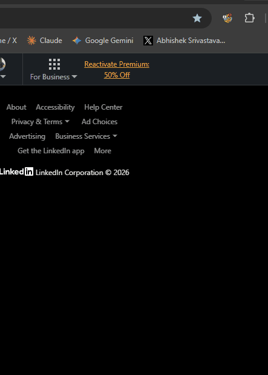

# 🤫 Passive Aggressive Translator

> **Corporate speak decoded. Passive aggression exposed.**
> Instantly translates loaded email jargon, corporate avoidance strategies, and subtle Slack manipulation into plain, honest English.

---

## 📖 The Problem & The Solution

Every professional knows the feeling: an email or Slack message lands in your inbox, and while the words are perfectly polite on the surface, the underlying tone is loaded with passive aggression, blame shifting, or avoidance.

**Passive Aggressive Translator** decodes the corporate theater in seconds. Simply paste any email, Slack ping, performance review, or passive Jira comment. The AI breaks down exactly what they *actually* mean, explains the political subtext at play, and drafts a direct, highly professional response that halts the passive-aggressive game in its tracks.

---

## ⚡ Core Features

- 💀 **Blunt, Honest Translation** — Strips away the layers of corporate softening and exposes the sender's core point, verbatim and unfiltered.
- 🕵 **Subtext & Dynamics Decoder** — Clearly explains the underlying power dynamics, blame avoidance, or manipulation attempts at play.
- 🛡 **No-Nonsense Response Generator** — Drafts a highly confident, professional reply that addresses the core issue directly without engaging in the passive-aggressive game.
- 💼 **Multi-Platform Ready** — Works on any textual source: emails, Slack channels, Jira tickets, performance reviews, or meeting notes.

---

## 🛠 Getting Started

### 1. Load the Extension
1. Clone this repository locally.
2. Open Chrome and navigate to `chrome://extensions`.
3. Toggle on **Developer mode** in the top right.
4. Click **Load unpacked** and select the `passive-aggressive-translator` folder.

### 2. Configure Your Keys
Launch the extension popup and click the **⚙** gear icon to configure your keys:
- **Gemini Key** — Get one for free at [aistudio.google.com](https://aistudio.google.com/apikey).
- **OpenRouter Key** (fallback) — Get one at [openrouter.ai](https://openrouter.ai).

> [!IMPORTANT]
> All pasted text is sent directly to secure AI endpoints. Your keys and workspace configurations are kept private inside your local browser storage.

---

## 🔧 Technical Stack

- **Extension Framework**: Chrome Extension Manifest V3
- **Primary AI Engine**: Gemini 2.0 Flash via AI Studio SDK
- **Fallback Engine**: OpenRouter API
- **Client Implementation**: Pure Vanilla JS, no build steps, zero bulky dependencies. Runs directly out of the folder.

---

## 📅 180 Days of Building
This project is part of a larger developer journey: shipping one useful AI tool/extension every day for 180 days.

Follow along for daily releases and tech-stack deep dives:
- **Twitter / X**: [@happy_ships](https://x.com/happy_ships)
- **Day**: `03 / 180`
- **Next Release**: `Recipe Rage Cleaner`

---

*Licensed under the [MIT License](LICENSE).*
